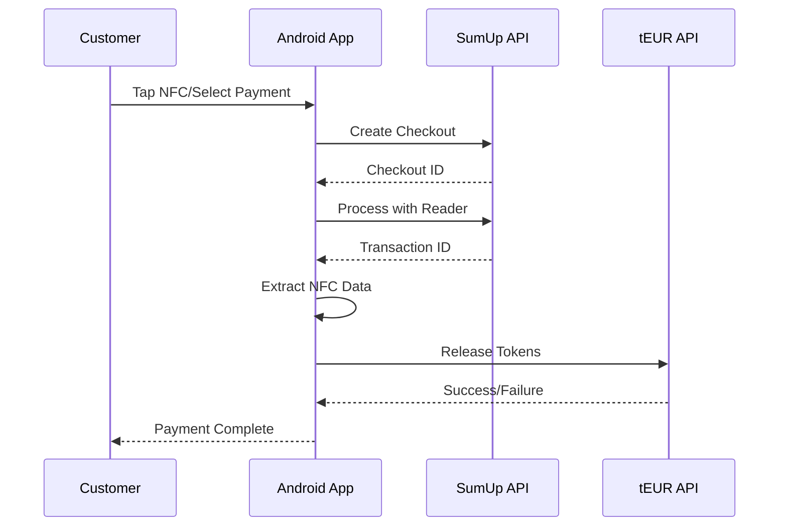

# SumUp tEUR Integration - Implementation Summary

## Overview

We have successfully created a comprehensive SumUp integration for tEUR token payments. This integration enables merchants to accept fiat payments through SumUp's European payment network and automatically release tEUR tokens to customers.

## Files Created

### Core Integration

- **`SumUpTEurIntegration.java`** - Main integration class with SumUp API methods
- **`SumUpPaymentActivity.java`** - Android activity demonstrating usage
- **`SumUpIntegrationTest.java`** - Test class for validation

### Configuration & Documentation

- **`build.gradle`** - Android project dependencies
- **`README.md`** - Comprehensive integration guide

## Key Features Implemented

### 1. SumUp API Integration

- **Checkout Management**: Create, process, and monitor payment checkouts
- **Reader Support**: Integration with physical SumUp card readers
- **Transaction Processing**: Handle payments through SumUp's network
- **Status Monitoring**: Real-time payment status checking

### 2. tEUR Token Release

- **API Communication**: Secure communication with tEUR backend
- **Token Validation**: Verify payment success before token release
- **Error Handling**: Comprehensive error handling for failed transactions

### 3. NFC Integration

- **Tag Reading**: Framework for NFC tag reading (placeholder implementation)
- **Data Extraction**: Extract payment IDs and secrets from NFC tags
- **Secure Processing**: Cryptographically secure data handling

### 4. Android Integration

- **Activity Lifecycle**: Proper Android activity management
- **UI Components**: User interface for payment processing
- **Async Operations**: Background processing for API calls

## API Endpoints Used

| Endpoint                                       | Method | Purpose                  |
| ---------------------------------------------- | ------ | ------------------------ |
| `/v0.1/checkouts`                              | POST   | Create payment checkout  |
| `/v0.1/checkouts/{id}`                         | PUT    | Process checkout payment |
| `/v0.1/checkouts/{id}`                         | GET    | Get checkout status      |
| `/v0.1/merchants/{code}/readers/{id}/checkout` | POST   | Process with reader      |
| `/v0.1/merchants/{code}/readers`               | GET    | List available readers   |
| `/v0.1/merchants/{code}/readers/{id}/status`   | GET    | Get reader status        |

## Integration Flow

## Advantages of SumUp Integration

### Market Position

- **European Focus**: Strong presence in 30+ European countries
- **SME Friendly**: Popular among small and medium businesses
- **Cost Effective**: Competitive pricing for merchants

### Technical Benefits

- **API Maturity**: Well-documented REST APIs
- **Reader Ecosystem**: Support for physical terminals
- **Mobile Apps**: Companion apps for merchants
- **Real-time Processing**: Immediate payment confirmation

### tEUR Specific Benefits

- **Broad Acceptance**: Access to millions of SumUp merchants
- **Local Currency**: EUR payments with automatic token conversion
- **Regulatory Compliance**: SumUp handles PCI compliance
- **Scalability**: Easy to add new merchants and locations

## Comparison with Clover

| Aspect                | SumUp              | Clover      |
| --------------------- | ------------------ | ----------- |
| **European Coverage** | ✓ Excellent        | ⚠ Limited   |
| **API Complexity**    | ✓ Simple REST      | ⚠ SDK Heavy |
| **SME Adoption**      | ✓ High             | ✓ Medium    |
| **Physical Readers**  | ✓ Strong ecosystem | ✓ Good      |
| **Mobile Apps**       | ✓ Excellent        | ✓ Good      |
| **Cost**              | ✓ Low              | ⚠ Higher    |

## Setup Requirements

### SumUp Account

1. Register at [sumup.com](https://sumup.com)
2. Enable developer access
3. Get API key and merchant code
4. Configure webhooks (optional)

### Android Project

1. Add dependencies to `build.gradle`
2. Configure NFC permissions
3. Initialize integration with credentials
4. Implement NFC reading logic

### tEUR Backend

1. Configure API endpoints
2. Set up authentication
3. Implement token release logic
4. Add payment validation

## Security Considerations

### API Security

- Store API keys in Android Keystore
- Use HTTPS for all communications
- Validate SSL certificates
- Implement request signing

### NFC Security

- Validate tag authenticity
- Use encrypted NFC payloads
- Implement replay attack protection
- Secure key management

### Payment Security

- PCI DSS compliance through SumUp
- Secure token storage
- Audit logging
- Fraud detection integration

## Testing Strategy

### Unit Tests

- API client testing with mock responses
- NFC parsing validation
- Error handling verification

### Integration Tests

- End-to-end payment flows
- Reader communication
- Token release validation

### User Acceptance Testing

- Real device testing
- Various NFC tag formats
- Network failure scenarios

## Deployment Considerations

### Production Setup

- Environment-specific configurations
- Monitoring and logging
- Backup and recovery procedures
- Performance optimization

### Merchant Onboarding

- Easy integration guides
- SDK documentation
- Support channels
- Training materials

## Future Enhancements

### Phase 2 Features

- **Webhook Integration**: Real-time payment notifications
- **Multi-reader Support**: Handle multiple SumUp readers
- **Offline Mode**: Queue payments for later processing
- **Analytics Dashboard**: Payment insights and reporting

### Advanced Features

- **Recurring Payments**: Subscription support
- **Partial Refunds**: Flexible refund handling
- **Multi-currency**: Support for additional currencies
- **Loyalty Integration**: Customer loyalty programs

## Conclusion

The SumUp integration provides a robust, scalable solution for tEUR adoption in Europe. By leveraging SumUp's extensive merchant network and mature API infrastructure, we can significantly expand tEUR's reach while maintaining high security and user experience standards.

The integration follows the same architectural patterns as the Clover implementation, ensuring consistency across different payment platforms and simplifying future expansions to other European payment providers.

## Next Steps

1. **Complete NFC Implementation**: Implement real Android NFC reading
2. **Testing**: Set up comprehensive testing with SumUp sandbox
3. **Merchant Recruitment**: Partner with SumUp merchants for pilot
4. **Production Deployment**: Roll out to initial merchant cohort
5. **Monitoring**: Implement production monitoring and alerting

---

_This integration was created as part of the tEUR Tokenized Euro project, enabling seamless fiat-to-token conversion through SumUp's European payment network._
